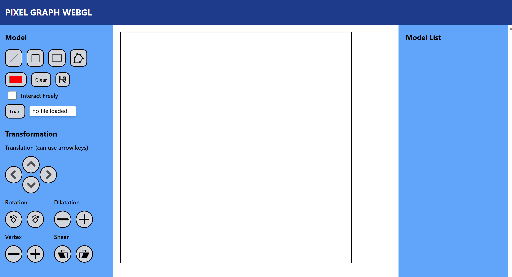

# tugas-besar-grafkom-1-pixelgraph
tugas-besar-grafkom-1-pixelgraph created by GitHub Classroom

- Nigel Sahl (13521043)
- Muhammad Equilibrie Fajria (13521047)
- Ghazi Akmal Fauzan (13521058)

## Table of Contents

  - [Table of Contents](#table-of-contents)
  - [General Information](#general-information)
  - [Technologies Used](#technologies-used)
  - [Features](#features)
  - [Primitive Function](#primitive-function)
  - [Screenshots](#screenshots)
  - [How to Run](#how-to-run)
  - [Project Status](#project-status)
  - [Room for Improvement](#room-for-improvement)

## General Information

WebGL is a JavaScript API for rendering interactive 2D and 3D graphics within any compatible web browser without the use of plug-ins. WebGL does so by introducing an API that closely conforms to OpenGL ES 2.0 that can be used in HTML5 `<canvas>` elements. This conformance to OpenGL ES 2.0 allows for the porting of applications that make use of the API to the web platform. WebGL is widely supported in modern browsers, including Google Chrome, Mozilla Firefox, Apple Safari, and Microsoft Edge. The API is also supported on mobile devices, including those running Android and iOS.


## Technologies Used

- WebGL
- HTML
- CSS
- JavaScript
- Tailwind CSS

## Features

These are the app's features:
1. Model
    - Line
    - Square
    - Rectangle
    - Polygon
2. Function
    - Transformation
        - Translation
        - Rotation
        - Dilatation
        - Shear
    - Adding vertex to a polygon model
    - Moving the vertex of a model
    - Changing the color of a model
    - Save the model
    - Load the model
    - Clear the model

## Screenshots



## How to Run

If you want to run the app, you only need to open ```index.html``` on folder ```src``` on your browser

If you want to develop the app, you can follow these step:

1. Clone this repository

2. Open the terminal and go to the project directory

3. Run the following command to install and start the tailwind css. Don't close the terminal after starting the tailwind until you finish using the application.

    ```bash
    npm install
    ```
    ```bash
    npm start
    ```

4. Open other terminal on the root project, then go to the src directory on your terminal
    ```bash
    cd src
    ```

5. Open the index.html file on your browser and it could be done with this command:
    ```bash
    .\index.html
    ```

6. Enjoy the application in your browser

## Project Status

Project is: _complete_

## Room for Improvement

Room for improvement:

- Speed up algorithm
- Make the application more user-friendly
- Add more features
